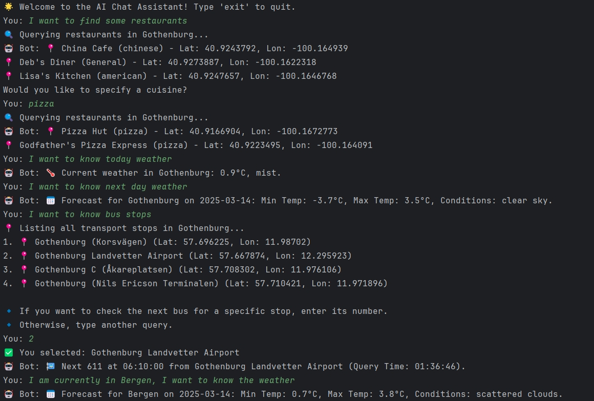
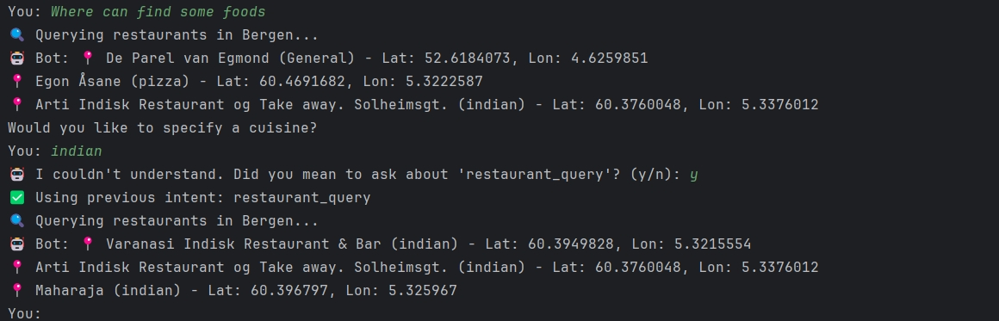

# chatBot

In this project, we developed a simple text-based digital assistant designed to assist users with multiple tasks by providing real-time and structured information. The assistant can perform at least three core functions:

- Retrieving weather forecasts  
- Recommending restaurants  
- Providing public transport schedules

These functionalities are implemented using external APIs and structured data sources, providing accurate and up-to-date information for users.

Our digital assistant supports natural, multi-turn conversations, allowing users to interact smoothly while the system retains contextual information from previous dialogues. This reduces redundant inputs and improves user experience. To simulate a more realistic scenario, we have set default values for location and time.

### Dialogue Example

  
  
*Figure: Multi-turn dialogue example*

### Code Structure

Our code is separated into different Python files to manage each component easily.  
For convenience, you can [**click here**](https://drive.google.com/drive/folders/1kFwkY2WeDs6Mgj4OYaNBuPQS2012BjIO?usp=sharing) to access the entire code.

---

## APIs and Data Sources

### 🌦️ Weather Queries

We utilized the [**OpenWeather API**](https://openweathermap.org/api), which provides real-time weather data and forecasts for locations worldwide.  
The data is structured in JSON format and includes:

- Temperature readings  
- Weather conditions  
- Short-term forecasts (up to 5 days)

### 🍽️ Restaurant Queries

We used the [**Overpass API**](https://dev.overpass-api.de/overpass-doc/en/index.html), which extracts geospatial data from OpenStreetMap.  
This API allows us to:

- Query restaurant locations within a specified city  
- Retrieve metadata such as restaurant names, cuisine types, and coordinates

### 🚆 Transport Queries

We utilized [**FlixTrain (Europe)**](https://mobilitydatabase.org/feeds/gtfs/tld-651) data from the Mobility Database, which provides GTFS (General Transit Feed Specification) datasets.  
These datasets consist of multiple structured text files containing:

- Stop information  
- Routes  
- Trip schedules

To simplify implementation, we selectively used files relevant to our application’s needs.

---
